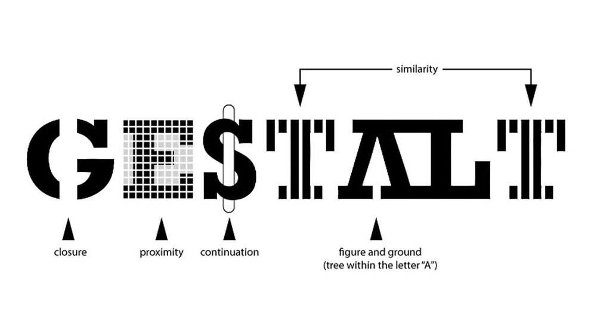
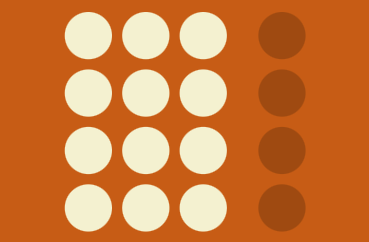
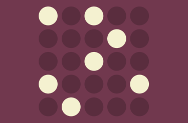

# Look and Feel - Corporate Identity

## Layout en compositie

Over Gestalt principes toepassen in je ontwerp.

### Aanpak

Je hebt met een team een styleguide gemaakt en nu ben je die aan het toepassen op meerdere pagina's voor de opdracht van de opdrachtgever.

In deze workshop leer je hoe je de layout en compositie met behulp van het Gestalt principe *grouping* goed kan vormgeven. 
Door in je ontwerp rekening te houden met Gestalt principes zorg je ervoor dat informatie duidelijk vorm gegeven is en de gebruiker de pagina goed begrijpt.

## Gestalt psychologie

Gestalt psyhologie gaat over hoe de mens de wereld om zich heen waarneemt. 
Onze hersenen herkenen vormen en patronen, en ordenen zodoende alle informatie die we zien (en horen en voelen). 
Een belangrijk Gestalt principes voor web design is *grouping*, oftewel het groeperen van informatie.

Het Gestalt principes *grouping* bestaat uit een aantal "wetten", zoals
- Law of Proximity, de wet van de nabijheid. Als elementen dicht bij elkaar staan, vinden onze hersenen dat deze bij elkaar horen.
- Law of Similarity, de wet van gelijkheid. Onze hersenen vinden dat figuren die er hetzelfde uitzien bij elkaar horen.
- Law of Continuity, de wet van continuïteit. We zien losse figuren die naast elkaar in een lijn of bocht lopen als een geheel.
- Law of Connectedness, de wet van de verbinding. We zien elementen die visueel verbonden zijn als een groep.

 
*Ons brein heeft de neiging om alles wat we zien te organiseren in groepen of samenhangende vormen - Bron: [labelvier.nl](https://labelvier.nl/blog/ontwerpprincipes-in-de-praktijk-de-gestalt-principes/)*

### Bronnen
[Ontwerpprincipes in de praktijk: de Gestalt-principes, bron Label vier](https://labelvier.nl/blog/ontwerpprincipes-in-de-praktijk-de-gestalt-principes/)

## Opdracht Gestalt wetten onderzoeken en presenteren (60 minuten)

Met een groepje van 3 onderzoek je onderstaande Gestalt wetten. 
Kies allemaal een van de wetten en schrijf op het whiteboard wie welke wet gaat onderzoeken. 
Presenteer aan elkaar hoe je de wet kan gebruiken voor web design.

Na de presentaties ga je de drie wetten toepassen op jouw ontwerp. 
Maak een issue aan met hoe de pagina’s er nu uit zien en voeg verbeterde versies toe met uitleg. 
Voer de wijzigingen door in code en sluit het issue met een commit.

### Law of Common Region

 
*Law of Common Region: Elements tend to be perceived into groups if they are sharing an area with a clearly defined boundary.*

Bekijk eerst *Law of Common Region* van de website Laws of UX. Lees daarna het artikel *The Principle of Common Region: Containers Create Groupings*. Maak schetsen en aantekeningen bij het artikel. Maak daarna een goed en een fout voorbeeld met de huisstijl-elementen van de opdrachtgever in Figma.

#### Bronnen
 
- [lawsofux.com/law-of-common-region](https://lawsofux.com/law-of-common-region/)
- [The Principle of Common Region: Containers Create Groupings, by Aurora Harley](https://www.nngroup.com/articles/common-region/)

### Law of Proximity

 
*Law of Proximity: Objects that are near, or proximate to each other, tend to be grouped together.*

Bekijk eerst *Law of Proximity* van de website Laws of UX . Lees daaran de artikelen *The Principle of Common Region: Containers Create Groupings* en *Gestalt Principles of Design — Proximity*. Maak schetsen en aantekeningen bij de artikelen. Maak daarna een goed en een fout voorbeeld met de huisstijl-elementen van de opdrachtgever in Figma.

#### Bronnen
 
- [lawsofux.com/law-of-proximity](https://lawsofux.com/law-of-proximity/)
- [Proximity Principle in Visual Design, by Aurora Harley](https://www.nngroup.com/articles/gestalt-proximity/)
- [Gestalt Principles of Design — Proximity, by Christopher Butler ](https://www.chrbutler.com/gestalt-principles-of-design-proximity/)

### Law of Similarity

 
*Law of Similarity: The human eye tends to perceive similar elements in a design as a complete picture, shape, or group, even if those elements are separated.*

Bekijk eerst *Law of Similarity* van de website Laws of UX . Lees daaran de artikelen *Similarity Principle in Visual Design* en *Gestalt Principles of Design — Similarity*. Maak schetsen en aantekeningen bij de artikelen. Maak daarna een goed en een fout voorbeeld met de huisstijl-elementen van de opdrachtgever in Figma.

#### Bronnen
 
- [lawsofux.com/law-of-similarity](https://lawsofux.com/law-of-similarity/)
- [Similarity Principle in Visual Design, by Aurora Harley](https://www.nngroup.com/articles/gestalt-similarity/)
- [Gestalt Principles of Design — Similarity, by Christopher Butler ](https://www.chrbutler.com/gestalt-principles-of-design-similarity/)
